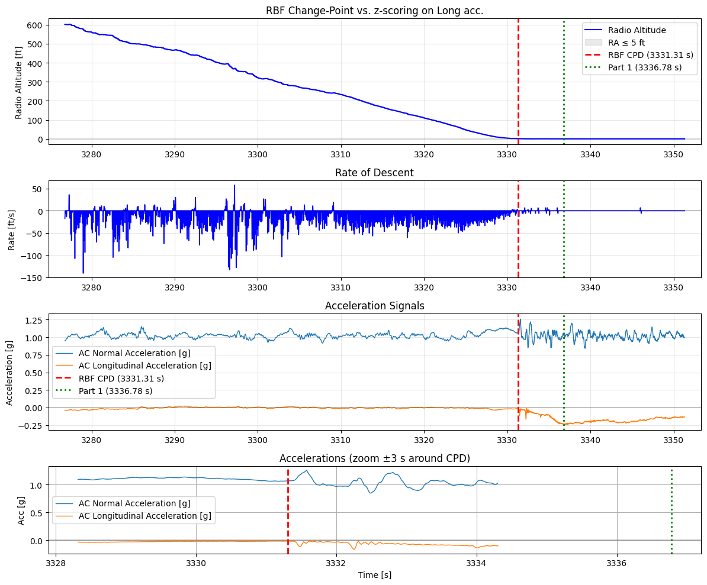
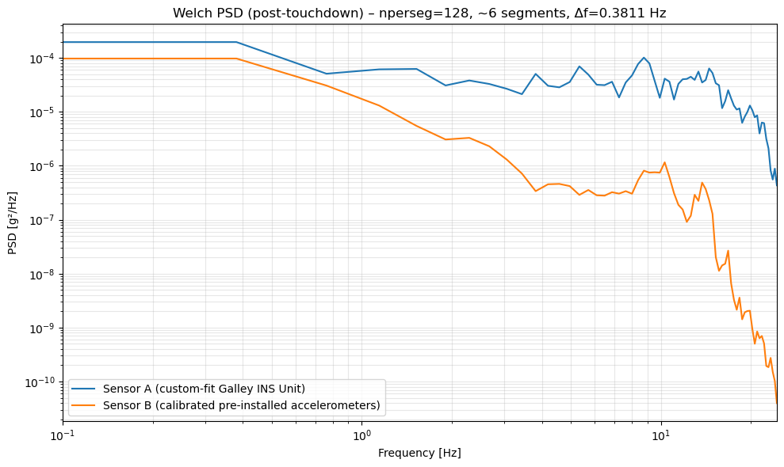
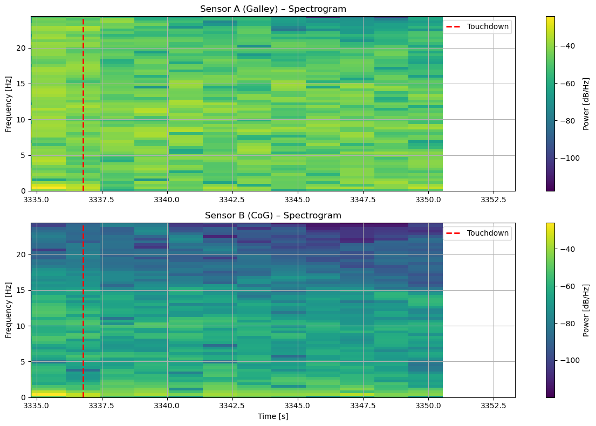

# Saab 340 landing analysis: sensor reliability and touchdown detection

Real flight-test data from Cranfield University's Saab 340 (8 minutes around landing, sampled at about 49 Hz): two independent accelerometers that never quite agree, and a touchdown invisible to the naked eye in the raw acceleration. Two notebooks answer two questions: which sensor can we trust, and exactly when did the aircraft touch down?



## Highlights

- **Full spectral characterization** (Welch's method, resolution 0.38 Hz): PSD, inter-sensor coherence, spectrograms and band-limited RMS, revealing local amplification at the galley-mounted sensor of **up to 14 times** the reference sensor's power at high frequencies.
- **Touchdown timestamped at 0.02 s resolution** by RBF kernel change-point detection (ruptures) on four standardized FDR channels: radio altitude, its derivative, normal and longitudinal accelerations.
- The change-point estimate is **consistent with radio altitude reaching 0 ft** and corrects the naive amplitude-peak estimate by about 5 s.
- Sensitivity analysis over channel subsets and kernel parameter, with all parameter tables in the notebooks for full reproducibility.

## Repository layout

| File | Role |
|---|---|
| `saab_landing_sensor_spectral_analysis.ipynb` | Part 1: sensor reliability by spectral methods |
| `saab_landing_touchdown_detection.ipynb` | Part 2: change-point detection and reconciliation |

## Run it

```bash
pip install -r requirements.txt
jupyter notebook
```

The flight-test dataset is used within Cranfield's IVHM course and is not redistributed here; the notebooks keep all outputs saved so the analysis is fully readable without the data.

## Gallery

| | |
|---|---|
|  |  |

Part of my [portfolio](https://ugo-roccamatisi.github.io).
